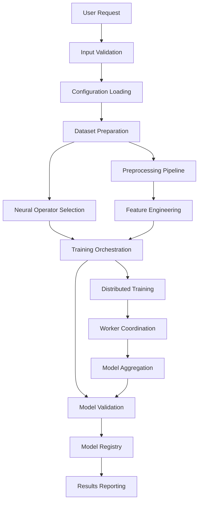
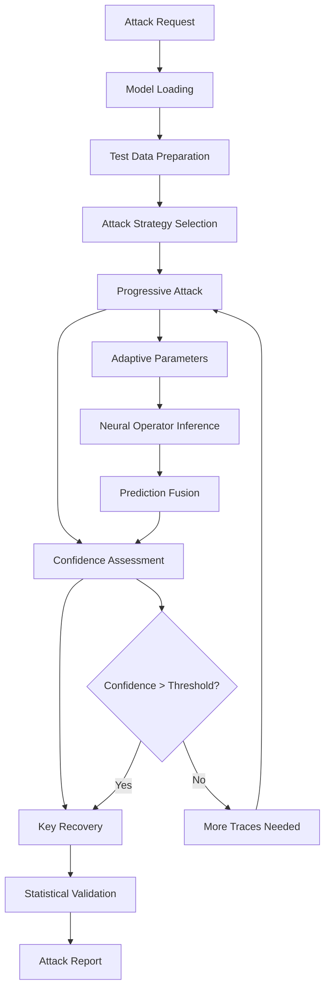
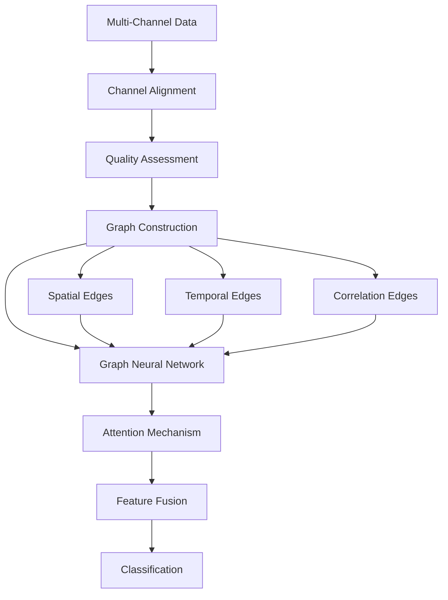

# Neural Operator Cryptanalysis Lab - Architecture Documentation

## Overview

The Neural Operator Cryptanalysis Lab implements a modular, scalable architecture for defensive side-channel analysis using neural operators. This document describes the system architecture, component interactions, data flow, and design patterns.

## Table of Contents

1. [System Overview](#system-overview)
2. [Architecture Layers](#architecture-layers)
3. [Component Interactions](#component-interactions)
4. [Data Flow](#data-flow)
5. [Neural Operator Pipeline](#neural-operator-pipeline)
6. [Hardware Integration](#hardware-integration)
7. [Multi-Modal Fusion](#multi-modal-fusion)
8. [Distributed Computing](#distributed-computing)
9. [Security Architecture](#security-architecture)
10. [Performance Considerations](#performance-considerations)

---

## System Overview

### High-Level Architecture

```
┌─────────────────────────────────────────────────────────────┐
│                    Neural Cryptanalysis Lab                 │
├─────────────────────────────────────────────────────────────┤
│  User Interfaces                                           │
│  ┌─────────────┬─────────────┬─────────────┬─────────────┐  │
│  │     CLI     │   Web API   │   Jupyter   │  Dashboard  │  │
│  └─────────────┴─────────────┴─────────────┴─────────────┘  │
├─────────────────────────────────────────────────────────────┤
│  Core Engine                                               │
│  ┌─────────────────────────────────────────────────────────┐ │
│  │                    NeuralSCA                           │ │
│  │  ┌─────────────┬─────────────┬─────────────────────────┐ │ │
│  │  │   Training  │   Attack    │   Countermeasure Eval  │ │ │
│  │  └─────────────┴─────────────┴─────────────────────────┘ │ │
│  └─────────────────────────────────────────────────────────┘ │
├─────────────────────────────────────────────────────────────┤
│  Neural Operators                                         │
│  ┌─────────────┬─────────────┬─────────────┬─────────────┐  │
│  │     FNO     │   DeepONet  │   GraphNO   │  PhysicsNO  │  │
│  └─────────────┴─────────────┴─────────────┴─────────────┘  │
├─────────────────────────────────────────────────────────────┤
│  Side-Channel Analysis                                     │
│  ┌─────────────┬─────────────┬─────────────┬─────────────┐  │
│  │    Power    │     EM      │  Acoustic   │   Optical   │  │
│  └─────────────┴─────────────┴─────────────┴─────────────┘  │
├─────────────────────────────────────────────────────────────┤
│  Target Implementations                                    │
│  ┌─────────────┬─────────────┬─────────────┬─────────────┐  │
│  │    Kyber    │  Dilithium  │  McEliece   │     AES     │  │
│  └─────────────┴─────────────┴─────────────┴─────────────┘  │
├─────────────────────────────────────────────────────────────┤
│  Infrastructure                                           │
│  ┌─────────────┬─────────────┬─────────────┬─────────────┐  │
│  │  Datasets   │   Storage   │  Monitoring │   Security  │  │
│  └─────────────┴─────────────┴─────────────┴─────────────┘  │
└─────────────────────────────────────────────────────────────┘
```

### Design Principles

1. **Modularity**: Each component is self-contained with clear interfaces
2. **Extensibility**: New neural operators and targets can be added easily
3. **Scalability**: Support for distributed processing and large datasets
4. **Security**: Defensive focus with comprehensive security measures
5. **Reproducibility**: Deterministic behavior and comprehensive logging

---

## Architecture Layers

### Layer 1: User Interface Layer

**Purpose**: Provide multiple interfaces for different user personas

**Components**:
- **Command Line Interface (CLI)**: Batch processing and automation
- **Web API**: RESTful API for integration
- **Jupyter Integration**: Interactive analysis and research
- **Dashboard**: Real-time monitoring and visualization

**Key Features**:
- Authentication and authorization
- Request validation and sanitization
- Rate limiting and resource management
- Comprehensive logging and audit trails

### Layer 2: Core Engine Layer

**Purpose**: Central orchestration and high-level API

**Components**:
- **NeuralSCA**: Main API class
- **LeakageSimulator**: Synthetic data generation
- **AttackOrchestrator**: Attack strategy coordination
- **ConfigManager**: Configuration management

**Data Flow**:
```
User Request → Validation → Configuration → Neural Operator Selection → Execution
```

### Layer 3: Neural Operator Layer

**Purpose**: Implement various neural operator architectures

**Components**:

#### Fourier Neural Operator (FNO)
```
Input Trace → Lifting → Fourier Layers → Projection → Classification
    ↓           ↓           ↓              ↓            ↓
[N, T] → [N, d] → [N, d] (spectral) → [N, d] → [N, classes]
```

**Architecture Details**:
- **Spectral Convolutions**: Efficient global receptive field
- **Multi-Resolution**: Multiple Fourier modes
- **Parameter Sharing**: Translation equivariance

#### DeepONet
```
Branch Net: Trace Segments → Feature Vector
    ↓
Trunk Net: Coordinates → Basis Functions
    ↓
Operator: Feature ⊗ Basis → Output
```

#### Graph Neural Operator
```
Multi-Modal Data → Graph Construction → Graph Convolutions → Fusion → Output
```

### Layer 4: Side-Channel Analysis Layer

**Purpose**: Implement channel-specific analysis methods

**Channel-Specific Processing**:

#### Power Analysis
```
Raw Traces → Preprocessing → POI Selection → Feature Extraction → Analysis
     ↓            ↓              ↓               ↓              ↓
  [N, T] → [N, T] (filtered) → [N, P] → [N, F] (features) → Results
```

#### EM Analysis
```
Spatial Data → Field Modeling → Source Localization → Leakage Analysis
     ↓              ↓               ↓                    ↓
  [N, X, Y, T] → Physics Model → [N, Sources] → [N, Features]
```

### Layer 5: Target Implementation Layer

**Purpose**: Model cryptographic implementations and their vulnerabilities

**Target Hierarchy**:
```
CryptographicTarget (Abstract)
    ├── PostQuantumTarget
    │   ├── LatticeBasedTarget
    │   │   ├── KyberImplementation
    │   │   └── DilithiumImplementation
    │   ├── CodeBasedTarget
    │   │   └── ClassicMcElieceImplementation
    │   └── HashBasedTarget
    │       └── SPHINCSImplementation
    └── ClassicalTarget
        ├── AESImplementation
        └── RSAImplementation
```

### Layer 6: Infrastructure Layer

**Purpose**: Support services and cross-cutting concerns

**Components**:
- **Data Management**: Dataset storage and versioning
- **Model Registry**: Trained model storage and metadata
- **Monitoring**: Performance metrics and health checks
- **Security**: Authentication, encryption, audit logging

---

## Component Interactions

### Training Workflow



### Attack Workflow



### Multi-Modal Fusion



---

## Data Flow

### Training Data Pipeline

```
Raw Traces → Preprocessing → Augmentation → Batching → Training
     ↓             ↓             ↓           ↓          ↓
[N, T, C] → [N, T, C] → [N', T, C] → [B, T, C] → Model Updates
```

**Preprocessing Steps**:
1. **Normalization**: Zero mean, unit variance
2. **Filtering**: Noise reduction and bandwidth limiting
3. **Alignment**: Temporal synchronization
4. **Segmentation**: Extract relevant time windows
5. **Point-of-Interest (POI) Selection**: Feature selection

**Data Augmentation**:
- **Temporal Jitter**: Random time shifts
- **Noise Addition**: Gaussian noise injection
- **Amplitude Scaling**: Random scaling factors
- **Mixup**: Linear combination of traces

### Inference Data Pipeline

```
Live Traces → Real-time Preprocessing → Model Inference → Decision
     ↓               ↓                       ↓             ↓
[1, T, C] → [1, T, C] (normalized) → [1, Classes] → Key Byte
```

---

## Neural Operator Pipeline

### Fourier Neural Operator Pipeline

```
Input Trace [batch, length]
    ↓
Lifting Layer: [batch, length] → [batch, width, length]
    ↓
Fourier Layer 1: Spectral Convolution + MLP
    ↓
Fourier Layer 2: Spectral Convolution + MLP
    ↓
...
    ↓
Fourier Layer N: Spectral Convolution + MLP
    ↓
Projection Layer: [batch, width, length] → [batch, classes]
    ↓
Global Average Pooling: [batch, classes, length] → [batch, classes]
    ↓
Softmax: [batch, classes] (probability distribution)
```

**Spectral Convolution Details**:
```python
def spectral_convolution_1d(x, weights, modes):
    # x: [batch, channels, length]
    # weights: [in_channels, out_channels, modes] (complex)
    
    # Forward FFT
    x_ft = torch.fft.rfft(x)  # [batch, channels, length//2+1]
    
    # Multiply relevant modes
    out_ft = torch.zeros_like(x_ft[:, :out_channels])
    out_ft[:, :, :modes] = torch.einsum(
        "bix,iox->box", 
        x_ft[:, :, :modes], 
        weights
    )
    
    # Inverse FFT
    x_out = torch.fft.irfft(out_ft, n=x.size(-1))
    
    return x_out
```

### Graph Neural Operator Pipeline

```
Multi-Modal Input [power, em_near, em_far, acoustic]
    ↓
Graph Construction
    ├── Nodes: Sensor/Time Points
    ├── Spatial Edges: Sensor Proximity
    ├── Temporal Edges: Time Dependencies
    └── Cross-Modal Edges: Channel Correlations
    ↓
Graph Attention Networks
    ├── Multi-Head Attention
    ├── Message Passing
    └── Feature Aggregation
    ↓
Global Graph Pooling
    ↓
Classification Head
```

---

## Hardware Integration

### Hardware-in-the-Loop Architecture

```
┌─────────────────────────────────────────────────────────────┐
│                    Control Computer                         │
│  ┌─────────────────────────────────────────────────────────┐ │
│  │           Neural Cryptanalysis Lab                     │ │
│  │  ┌─────────────┬─────────────┬─────────────────────────┐ │ │
│  │  │ Hardware    │ Real-time   │ Attack Orchestration   │ │ │
│  │  │ Control     │ Analysis    │                        │ │ │
│  │  └─────────────┴─────────────┴─────────────────────────┘ │ │
│  └─────────────────────────────────────────────────────────┘ │
└─────────────────────┬───────────────────────────────────────┘
                      │ USB/Ethernet
                      ▼
    ┌─────────────────────────────────────────────────────────┐
    │              Measurement Setup                          │
    │  ┌─────────────┬─────────────┬─────────────────────────┐ │
    │  │Oscilloscope │   EM Probe  │    Target Board        │ │
    │  │   (Power)   │             │   (Crypto Device)      │ │
    │  └─────────────┴─────────────┴─────────────────────────┘ │
    └─────────────────────────────────────────────────────────┘
```

**Integration Components**:

1. **Device Abstraction Layer**:
   ```python
   class HardwareDevice(ABC):
       @abstractmethod
       def connect(self) -> bool
       
       @abstractmethod  
       def configure(self, config: Dict) -> bool
       
       @abstractmethod
       def acquire_trace(self) -> np.ndarray
       
       @abstractmethod
       def disconnect(self) -> bool
   ```

2. **Synchronization Manager**:
   ```python
   class SynchronizationManager:
       def __init__(self, devices: List[HardwareDevice]):
           self.devices = devices
           self.trigger_device = None
           
       def synchronized_capture(self, n_traces: int) -> Dict[str, np.ndarray]:
           # Coordinate multi-device capture
           pass
   ```

3. **Real-time Analyzer**:
   ```python
   class RealTimeAnalyzer:
       def __init__(self, model: NeuralOperator):
           self.model = model
           self.buffer = CircularBuffer(size=1000)
           
       def process_trace(self, trace: np.ndarray) -> AttackResult:
           # Real-time neural operator inference
           pass
   ```

---

## Multi-Modal Fusion

### Graph Construction Strategy

```python
def construct_multimodal_graph(data: Dict[str, np.ndarray]) -> Data:
    """Construct graph from multi-modal sensor data."""
    
    # Node features: [sensor_type, temporal_position, signal_value]
    node_features = []
    edge_indices = []
    edge_attrs = []
    
    n_sensors = len(data)
    n_timepoints = data[list(data.keys())[0]].shape[1]
    
    # Create nodes for each sensor-time combination
    for sensor_idx, (sensor_name, traces) in enumerate(data.items()):
        for time_idx in range(n_timepoints):
            node_features.append([
                sensor_idx,           # Sensor type encoding
                time_idx / n_timepoints,  # Normalized time
                traces.mean(axis=0)[time_idx]  # Signal value
            ])
    
    # Spatial edges: Connect same-time different-sensor nodes
    for t in range(n_timepoints):
        for s1 in range(n_sensors):
            for s2 in range(s1 + 1, n_sensors):
                node1 = t * n_sensors + s1
                node2 = t * n_sensors + s2
                
                # Bidirectional edges
                edge_indices.extend([[node1, node2], [node2, node1]])
                
                # Edge attributes: spatial correlation
                correlation = compute_correlation(data, s1, s2, t)
                edge_attrs.extend([correlation, correlation])
    
    # Temporal edges: Connect same-sensor different-time nodes  
    for s in range(n_sensors):
        for t in range(n_timepoints - 1):
            node1 = t * n_sensors + s
            node2 = (t + 1) * n_sensors + s
            
            edge_indices.extend([[node1, node2], [node2, node1]])
            
            # Edge attributes: temporal correlation
            temporal_corr = 1.0  # Adjacent time points
            edge_attrs.extend([temporal_corr, temporal_corr])
    
    return Data(
        x=torch.tensor(node_features, dtype=torch.float),
        edge_index=torch.tensor(edge_indices, dtype=torch.long).t(),
        edge_attr=torch.tensor(edge_attrs, dtype=torch.float)
    )
```

### Attention-Based Fusion

```python
class CrossModalAttention(nn.Module):
    def __init__(self, hidden_dim: int, n_heads: int = 8):
        super().__init__()
        self.attention = nn.MultiheadAttention(
            embed_dim=hidden_dim,
            num_heads=n_heads,
            batch_first=True
        )
        
    def forward(self, 
                query_modality: torch.Tensor,
                key_value_modalities: List[torch.Tensor]) -> torch.Tensor:
        
        # Stack all modalities for attention
        kv_stacked = torch.stack(key_value_modalities, dim=1)  # [B, n_modalities, D]
        
        # Reshape query for attention
        query = query_modality.unsqueeze(1)  # [B, 1, D]
        
        # Cross-modal attention
        attended, weights = self.attention(
            query=query,
            key=kv_stacked, 
            value=kv_stacked
        )
        
        return attended.squeeze(1), weights
```

---

## Distributed Computing

### Distributed Training Architecture

```
Master Node
    ├── Task Coordinator
    ├── Model Aggregator  
    ├── Data Scheduler
    └── Health Monitor
         │
    ┌────┴────┬────────┬────────┐
    │         │        │        │
Worker 1   Worker 2  Worker 3  Worker N
    │         │        │        │
 Local     Local    Local    Local
Training  Training Training Training
```

**Components**:

1. **Distributed Coordinator**:
   ```python
   class DistributedCoordinator:
       def __init__(self, worker_configs: List[Dict]):
           self.workers = []
           self.data_shards = []
           self.model_registry = ModelRegistry()
           
       async def submit_training_job(self, 
                                   data: TraceData,
                                   config: TrainingConfig) -> TrainingResult:
           # Shard data across workers
           shards = self.shard_data(data, len(self.workers))
           
           # Distribute training tasks
           tasks = []
           for worker, shard in zip(self.workers, shards):
               task = worker.train_async(shard, config)
               tasks.append(task)
           
           # Aggregate results
           results = await asyncio.gather(*tasks)
           aggregated_model = self.aggregate_models(results)
           
           return TrainingResult(
               model=aggregated_model,
               metrics=self.combine_metrics(results)
           )
   ```

2. **Data Sharding Strategy**:
   ```python
   def shard_data(self, data: TraceData, n_shards: int) -> List[TraceData]:
       """Intelligent data sharding for distributed training."""
       
       # Stratified sampling to maintain label distribution
       shards = []
       labels = data.labels
       unique_labels = np.unique(labels)
       
       for shard_idx in range(n_shards):
           shard_indices = []
           
           for label in unique_labels:
               label_indices = np.where(labels == label)[0]
               shard_size = len(label_indices) // n_shards
               start_idx = shard_idx * shard_size
               end_idx = start_idx + shard_size
               
               if shard_idx == n_shards - 1:  # Last shard gets remainder
                   end_idx = len(label_indices)
               
               shard_indices.extend(label_indices[start_idx:end_idx])
           
           # Create shard
           shard = TraceData(
               traces=data.traces[shard_indices],
               labels=data.labels[shard_indices],
               metadata=data.metadata
           )
           shards.append(shard)
       
       return shards
   ```

---

## Security Architecture

### Defense-in-Depth Security Model

```
┌─────────────────────────────────────────────────────────────┐
│                    Security Layers                          │
├─────────────────────────────────────────────────────────────┤
│  Application Security                                       │
│  ├── Input Validation                                       │
│  ├── Authentication & Authorization                         │
│  ├── Rate Limiting                                          │
│  └── Audit Logging                                          │
├─────────────────────────────────────────────────────────────┤
│  Data Security                                              │
│  ├── Encryption at Rest                                     │
│  ├── Encryption in Transit                                  │
│  ├── Data Anonymization                                     │
│  └── Secure Deletion                                        │
├─────────────────────────────────────────────────────────────┤
│  Infrastructure Security                                    │
│  ├── Network Segmentation                                   │
│  ├── Container Security                                     │
│  ├── Secrets Management                                     │
│  └── Vulnerability Scanning                                 │
├─────────────────────────────────────────────────────────────┤
│  Compliance & Ethics                                        │
│  ├── Responsible Use Enforcement                            │
│  ├── Privacy Controls                                       │
│  ├── Regulatory Compliance                                  │
│  └── Ethical Guidelines                                     │
└─────────────────────────────────────────────────────────────┘
```

**Security Components**:

1. **Authentication System**:
   ```python
   class SecurityManager:
       def __init__(self):
           self.auth_provider = AuthenticationProvider()
           self.audit_logger = AuditLogger()
           
       def authenticate_user(self, credentials: Dict) -> User:
           user = self.auth_provider.verify(credentials)
           self.audit_logger.log_authentication(user)
           return user
           
       def authorize_operation(self, user: User, operation: str) -> bool:
           authorized = self.check_permissions(user, operation)
           self.audit_logger.log_authorization(user, operation, authorized)
           return authorized
   ```

2. **Data Protection**:
   ```python
   class DataProtection:
       def __init__(self, encryption_key: bytes):
           self.cipher = Fernet(encryption_key)
           
       def encrypt_traces(self, traces: np.ndarray) -> bytes:
           # Serialize and encrypt trace data
           serialized = pickle.dumps(traces)
           encrypted = self.cipher.encrypt(serialized)
           return encrypted
           
       def anonymize_metadata(self, metadata: Dict) -> Dict:
           # Remove personally identifiable information
           anonymized = metadata.copy()
           anonymized.pop('user_id', None)
           anonymized.pop('session_id', None)
           return anonymized
   ```

---

## Performance Considerations

### Computational Complexity

| Component | Training Complexity | Inference Complexity | Memory Usage |
|-----------|-------------------|---------------------|--------------|
| FNO | O(N log N) per epoch | O(log N) | O(N + M) |
| DeepONet | O(N²) per epoch | O(N) | O(N² + M) |
| GraphNO | O(E + V) per epoch | O(E + V) | O(V + E) |

Where:
- N: Trace length
- M: Model parameters  
- V: Graph vertices
- E: Graph edges

### Optimization Strategies

1. **Memory Optimization**:
   ```python
   # Gradient checkpointing for large models
   model = FourierNeuralOperator(modes=64, width=256)
   model = torch.utils.checkpoint.checkpoint_sequential(model, segments=4)
   
   # Mixed precision training
   scaler = torch.cuda.amp.GradScaler()
   
   with torch.cuda.amp.autocast():
       output = model(input_traces)
       loss = criterion(output, targets)
   
   scaler.scale(loss).backward()
   scaler.step(optimizer)
   scaler.update()
   ```

2. **Compute Optimization**:
   ```python
   # Efficient batching for variable-length traces
   def collate_traces(batch):
       traces, labels = zip(*batch)
       
       # Pad to maximum length in batch
       max_length = max(len(trace) for trace in traces)
       padded_traces = torch.zeros(len(traces), max_length)
       
       for i, trace in enumerate(traces):
           padded_traces[i, :len(trace)] = torch.tensor(trace)
       
       return padded_traces, torch.tensor(labels)
   
   dataloader = DataLoader(
       dataset,
       batch_size=64,
       collate_fn=collate_traces,
       num_workers=4,
       pin_memory=True
   )
   ```

### Scaling Guidelines

| Dataset Size | Recommended Architecture | Hardware Requirements |
|-------------|-------------------------|----------------------|
| < 10K traces | Single FNO | 1 GPU, 8GB RAM |
| 10K - 100K | FNO + Distributed | 2-4 GPUs, 32GB RAM |
| 100K - 1M | GraphNO + Cluster | 8+ GPUs, 128GB RAM |
| > 1M traces | Full Distributed | Multi-node cluster |

---

## Deployment Architecture

### Container Architecture

```dockerfile
# Multi-stage build for optimized production image
FROM pytorch/pytorch:1.12-cuda11.6-cudnn8-devel AS builder
COPY requirements.txt .
RUN pip install --no-cache-dir -r requirements.txt

FROM pytorch/pytorch:1.12-cuda11.6-cudnn8-runtime AS production
COPY --from=builder /opt/conda /opt/conda
COPY src/ /app/src/
WORKDIR /app
EXPOSE 8000
CMD ["python", "-m", "neural_cryptanalysis.api"]
```

### Kubernetes Deployment

```yaml
apiVersion: apps/v1
kind: Deployment
metadata:
  name: neural-cryptanalysis
spec:
  replicas: 3
  selector:
    matchLabels:
      app: neural-cryptanalysis
  template:
    metadata:
      labels:
        app: neural-cryptanalysis
    spec:
      containers:
      - name: neural-sca
        image: neural-cryptanalysis:latest
        resources:
          requests:
            memory: "4Gi"
            cpu: "2"
            nvidia.com/gpu: "1"
          limits:
            memory: "8Gi"
            cpu: "4"
            nvidia.com/gpu: "1"
        env:
        - name: CUDA_VISIBLE_DEVICES
          value: "0"
```

This architecture provides a robust, scalable, and secure foundation for neural operator-based cryptanalysis research while maintaining the defensive focus and responsible use principles.